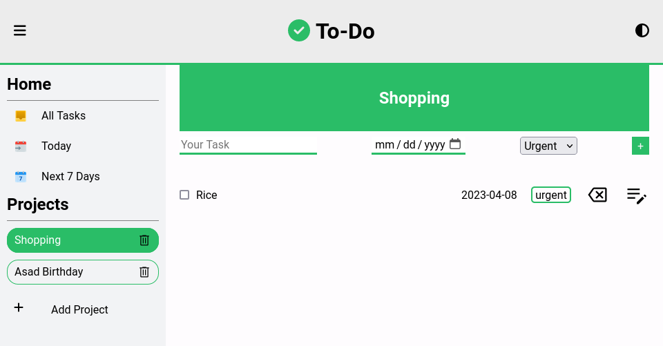
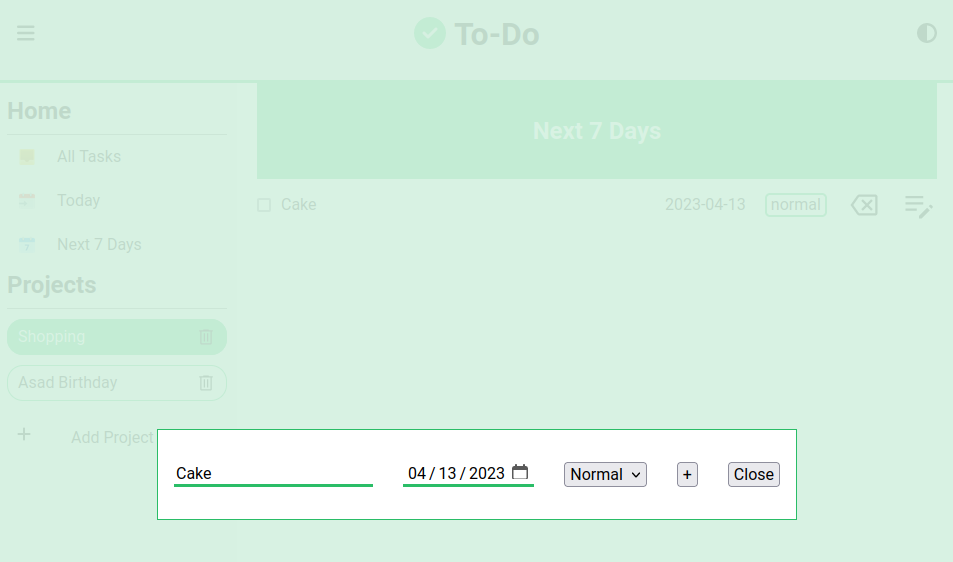
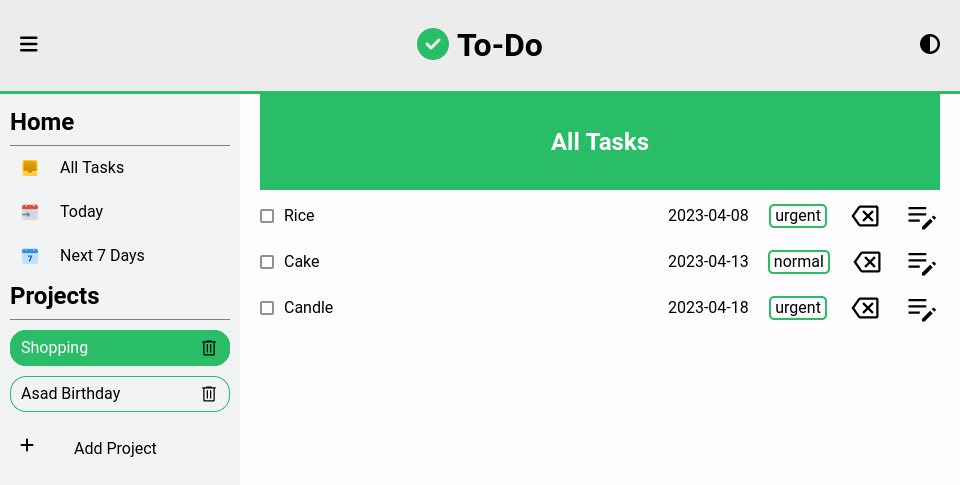
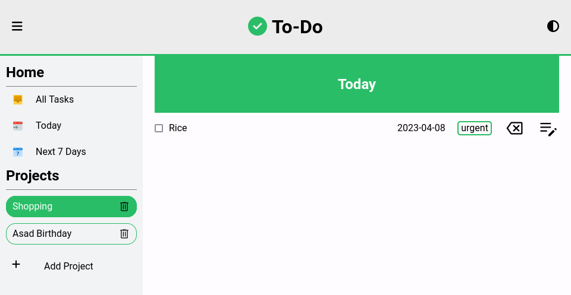
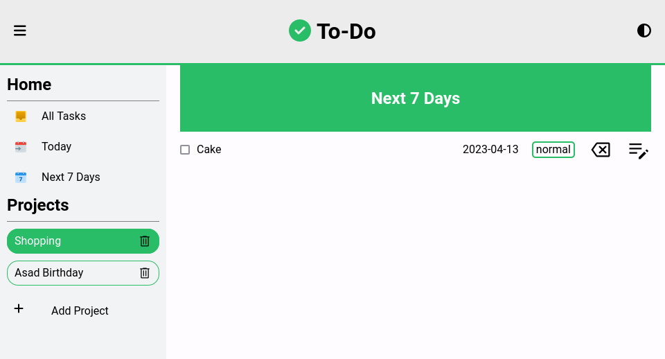

# Todo List

This is a solution to the [The Odin Project Todo List](https://www.theodinproject.com/lessons/node-path-javascript-todo-list). The Odin project
will help you to learn web development at your own pace.

## Table of contents

- [Overview](#overview)
  - [Screenshot](#screenshot)
  - [Links](#links)
- [My process](#my-process)
  - [Built with](#built-with)
- [Author](#author)

## Overview

### Screenshot

- Add todo list
  
- Edit todo list
  
- All todo list
  
- Task for today
  
- Task for next 7 days
  

### Links

- Solution URL: [Solution](https://github.com/ZTanvir/todo-list)
- Live Site URL: [Live site](https://ztanvir.github.io/todo-list/)

## Bugs

- If you add more than one todo list with same name,when you edit or delete
  any,it will change the first one.Other todo list will be as it was before.

### For perosnal use

- Clone the code.
- Change the directory to todo-list
- Install npm package.with - npm install
- Start the application with - npm start

### Built with

- Semantic HTML5 markup
- CSS custom properties
- Flexbox
- CSS Grid
- Javscript
- Js Dom
- Web Api Localstorage

## Author

- Github - [Zahirul Islam Tanvir](https://github.com/ZTanvir)
